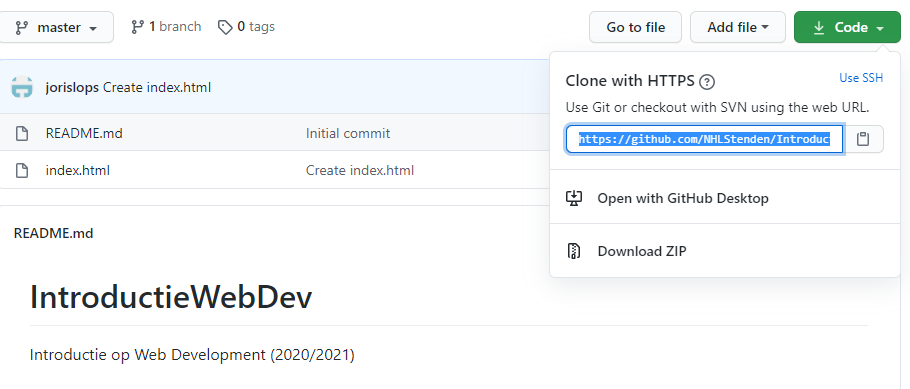

# Introductie Web Devevelopment NHL Stenden 
Welkom bij de GIT Repository voor het vak Web Development bij de NHL Stenden in het eerste jaar.

Hier wordt code gedeeld uit de lessen. Je kunt deze repository op je eigen PC zetten door te gebruik maken van de GIT-software. Gebruik dan voor `git clone` [deze](https://github.com/NHLStenden/IntroductieWebDev.git) URL. 

Een andere oplossing is door een ZIP-file van deze code te downloaden. Druk dan op de groene knop ('Code') op GitHub en klik dan op 'Download ZIP'. Na het downloaden van deze ZIP-file kun je deze uitpakken. 

Het voordeel van het werken met Git-software is dat je eenvoudig regelmatig de nieuwe versie kunt ophalen met `git pull`. 

**Let op** Als je werkt met de git-software, dan wordt elke keer dat je de nieuwe versie opgehaald gekeken of jij zelf wijzigingen hebt gemaakt. Als dat het geval is dan wil het niet lukken om de nieuwe versie op te halen. 

Dus: maak zelf een mapje aan op je PC waar je de code uitprobeert, verbetert etc. Code uit deze repository moet je dan dus even kopieren/plakken naar je eigen omgeving.

